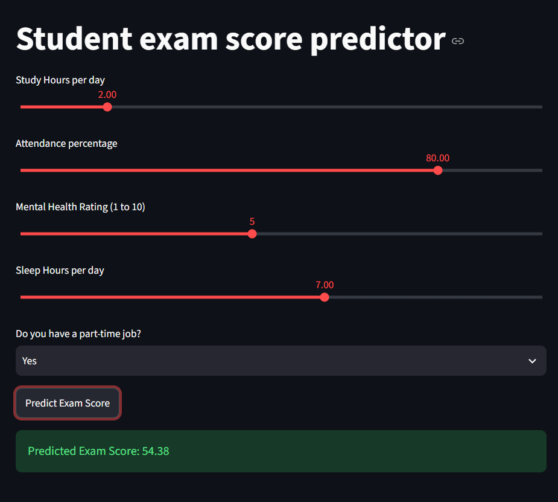
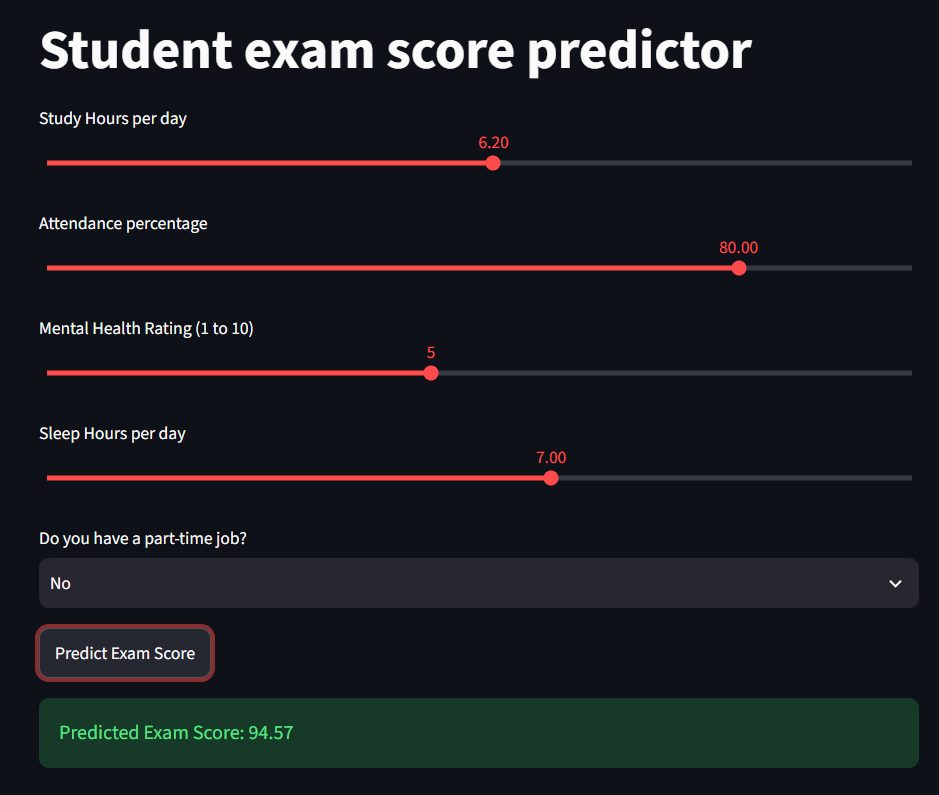
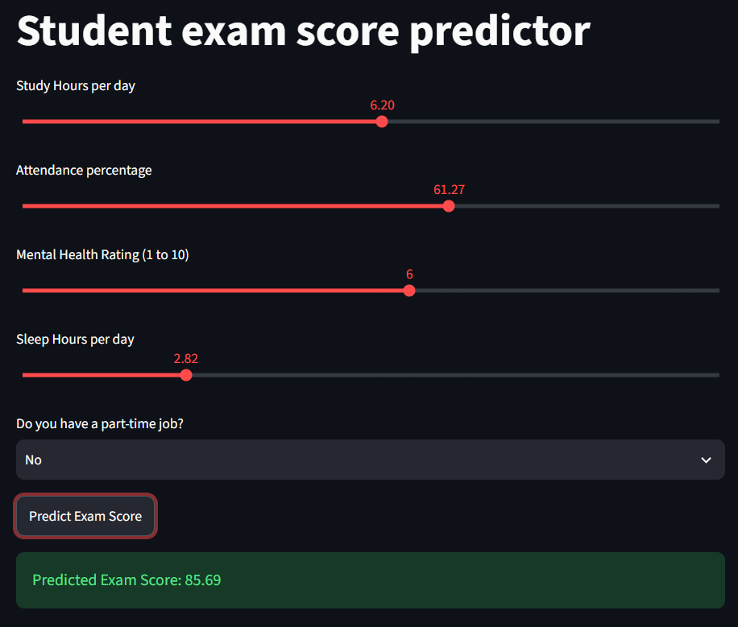

# Student Result Prediction

https://studentresultpredictor-p6exfbg5cqw9p4zs4zqcoa.streamlit.app/

Local run (for testing):

```powershell
python -m venv .venv
.venv\Scripts\Activate.ps1
pip install -r requirements.txt
streamlit run App.py
```


# Sample Output



